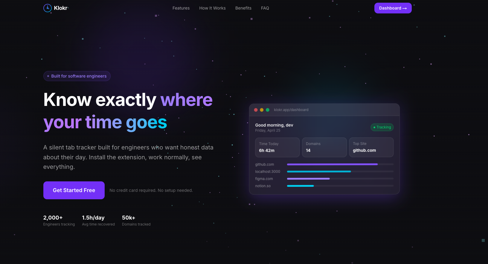
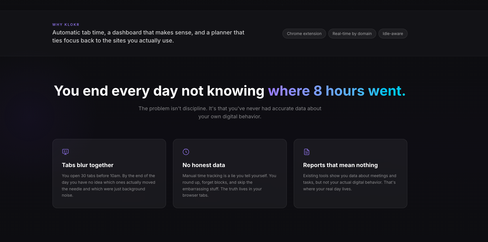
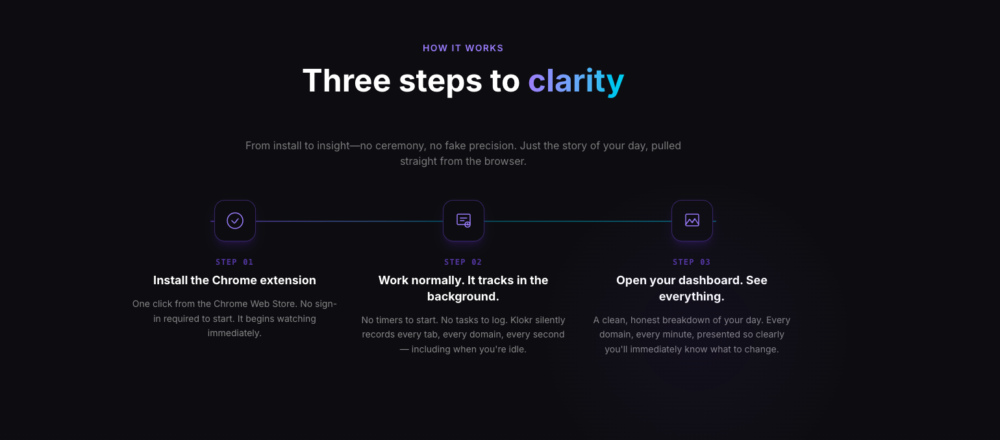
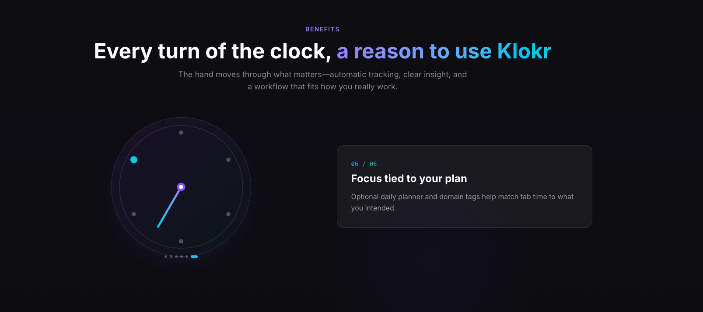
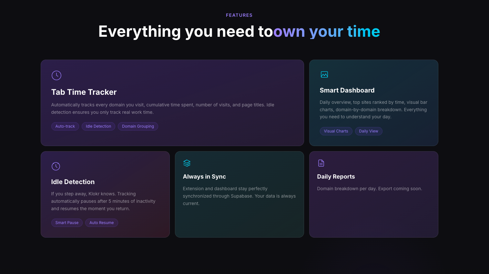

  
  <h1>Klokr</h1>
  
<strong>Know exactly where your time goes.</strong>

  
A silent tab tracker built for engineers who want honest data about their day.

   
  <a href="https://github.com/Abdul-Moiz31">Built by Abdul-Moiz31</a>

---

---

## Why this exists

Most engineers end their day with no real idea where the hours went. You opened tabs. You worked. Eight hours passed. But if someone asked you to account for the day you would struggle to give an honest answer. That is not a discipline problem. It is a data problem. You never had accurate information about your own digital behavior, so you could not do anything about it. Klokr fixes that.

---

## What it does

**Tab Time Tracker**
Automatically tracks every domain you visit. Cumulative time per site, number of visits, page titles. Idle detection means if you step away from the computer the clock stops. Everything syncs to your dashboard the moment it happens. No manual input. No timers to start.

**Reports**
Daily, weekly, and monthly breakdowns of where your time went. Each domain is ranked by total time with a percentage of your day. You can drill into any domain to see individual pages and an hourly activity chart. Export any report as a PDF in one click.

**Activity**
A 90-day heatmap of your browsing activity so you can see patterns across weeks, not just yesterday. Streak tracking, productive day counters, and a day-by-day breakdown when you want to dig deeper.

**Daily Planner**
A lightweight task list built into the dashboard. Each task can be tagged with a domain so the time you spend on that site maps back to the work you said you were doing. You see planned work next to actual browser time in the same view.

**Routine Templates**
Create day templates for weekdays, Saturdays, Sundays, or any custom schedule. Define what a productive day looks like for you and compare it against what actually happened.

**Pomodoro**
Focus sessions and break cycles built directly into the dashboard. No separate app. No context switching. It sits alongside your tracker so you can see if your pomodoro sessions actually moved the needle.

**Chrome Extension**
A silent background process that runs while you work. The popup shows today's top sites and total time at a glance. Tracks everything. Gets out of your way.

---

## How it works

Install the Chrome extension from the Chrome Web Store. One click. No sign-in required to start. It begins watching immediately.

Work normally. Klokr records every tab, every domain, and every second in the background. You do not touch it. There are no timers to start and no logs to fill in. It even detects when you go idle and pauses automatically.

Open your dashboard when you are ready to look. Every domain you visited, every minute you spent, organized by day, week, and month. You will know within thirty seconds where your time actually went.

---

## Who it is for

**Software engineers** who want honest data about their workday and are tired of guessing where the hours go.

**Aspiring developers** who are learning on the side and want to know if they are actually putting in the hours they think they are.

**Freelancers** who need to understand how they spend billable time across clients and projects, without expensive time-tracking software.

**Anyone serious about their time** who wants to own how they spend their day, not just track it.

---

---

You built things today. Klokr just makes sure you can prove it.

---

  Built by <a href="https://github.com/Abdul-Moiz31">Abdul-Moiz31</a>

